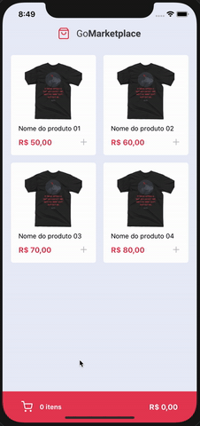

<p align="center">
  
</p>
<br>

<h1 align="center">Welcome to GoMarketplace 👋</h1>

<p align="center">
  
</p>

<p align="center"> Shop App for sale any product types</p>
<br>

## Demo

<p align="center">
  
</p>

## Install

```sh
yarn
```

## Usage

If you are on mac

```sh
yarn ios
```

If you are on windows

```sh
yarn android
```

## Author

👤 **Gabriel Menezes**

- Github: [@mnzsss](https://github.com/mnzsss)
- Linkedin: https://www.linkedin.com/in/mnzs/

## Show your support

Give a ⭐️ if this project helped you!

---

_This README was generated with ❤️ by [readme-md-generator](https://github.com/kefranabg/readme-md-generator)_
